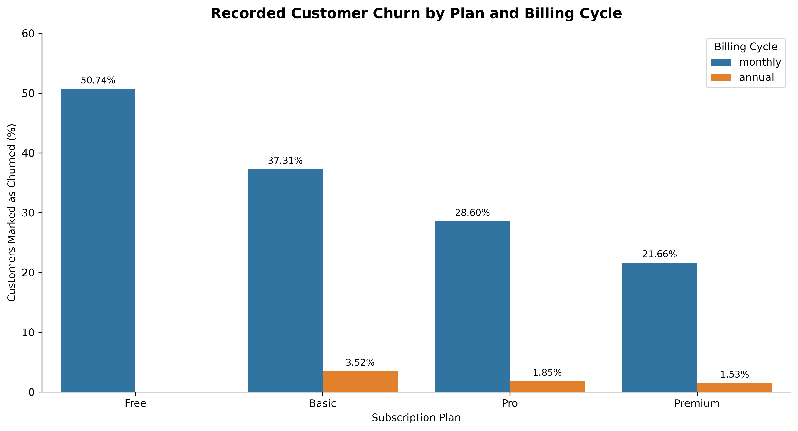
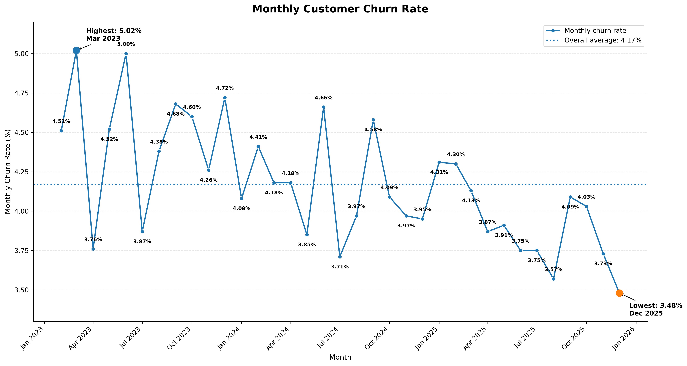
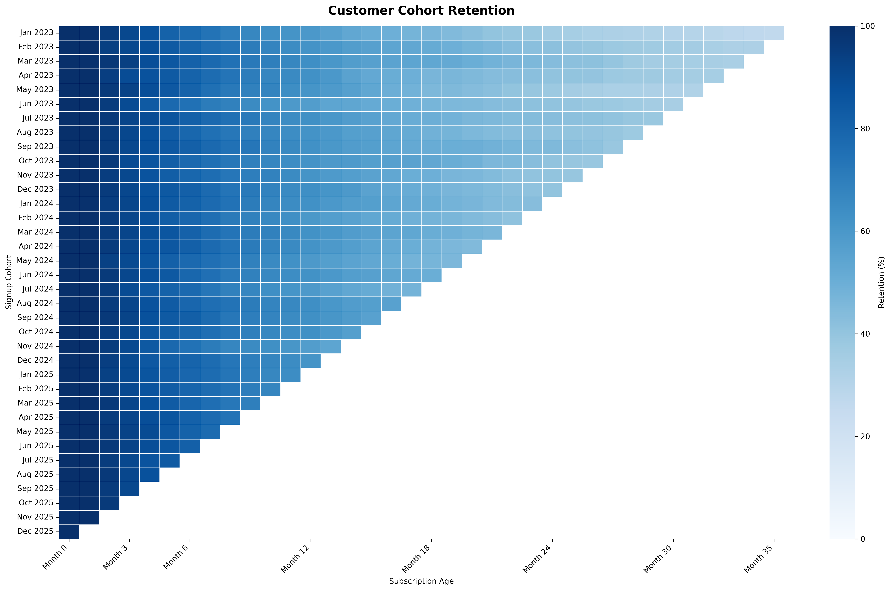
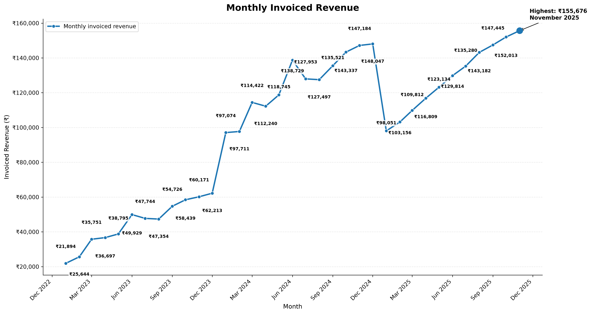
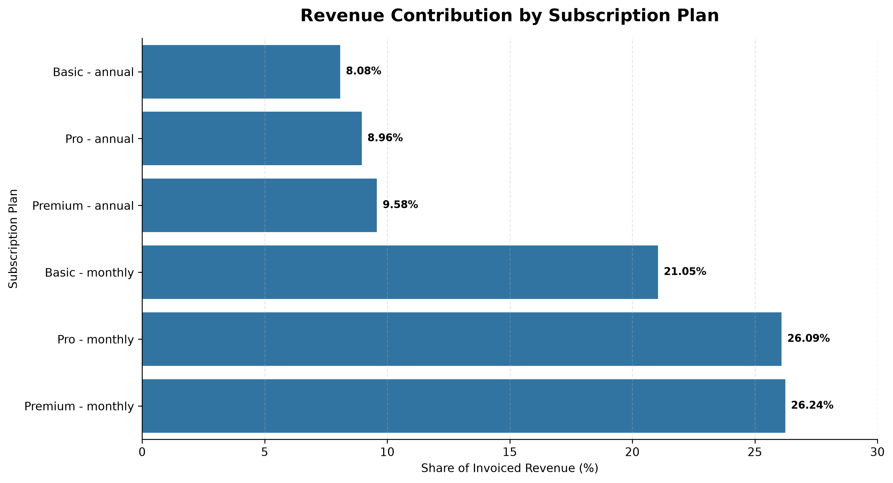
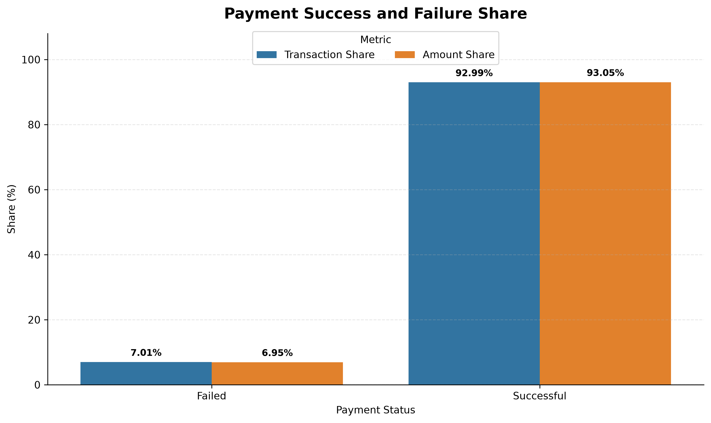

# SaaS Customer Retention, Churn & Revenue Analytics

## Project Overview

This project analyzes a synthetic SaaS subscription dataset to explore customer churn, retention, revenue, payment performance, and subscription plan changes.

The analysis was performed using Python with Pandas, NumPy, Matplotlib, Seaborn, SciPy, and Plotly.

The project follows a practical data analytics workflow:

**Raw Data → Data Inspection → Data Quality Checks → Data Preparation → Exploratory Analysis → Statistical Analysis → Visualization → Business Insights**

## Dataset Source & Attribution

The dataset used in this project is the **Synthetic SaaS Subscription Dataset**, created by **Muzammil Ansari** and obtained from Kaggle.

- **Dataset:** Synthetic SaaS Subscription Dataset
- **Creator:** Muzammil Ansari
- **Source:** [Kaggle – Synthetic SaaS Subscription Dataset](https://www.kaggle.com/datasets/ansarimuzammil/synthetic-saas-subscription-dataset)
- **License:** CC0: Public Domain

The dataset was used for educational and portfolio analysis. All data preparation, analysis, statistical testing, visualizations, and business interpretations presented in this repository were performed as part of this project.

The dataset is synthetic and its results should not be interpreted as industry benchmarks.

## Dataset Overview

The project uses seven related CSV files covering customer profiles, subscriptions, subscription plans, invoices, payments, plan changes, and churn events.

| Dataset | Description |
|---|---|
| `customers.csv` | Customer profile and acquisition information |
| `subscriptions.csv` | Subscription start, end, status, and plan information |
| `subscription_plans.csv` | Subscription plan names, billing cycles, and prices |
| `invoices.csv` | Invoice records and billed amounts |
| `payments.csv` | Payment transactions, statuses, and failure information |
| `plan_chnages.csv` | Recorded subscription plan changes |
| `Churn_events.csv` | Recorded customer churn events |

## Analysis Areas

The analysis focuses on:

- Customer churn and retention
- Subscription plan performance
- Cohort retention and customer tenure
- Revenue trends and plan-level revenue contribution
- Payment success and failure performance
- Customer monetization by tenure and plan
- Subscription plan changes and conversion timing
- Statistical relationships between customer attributes and churn

## Key Results

The analysis identified several notable patterns within the dataset:

- **25,000 customers** were analyzed, with **9,757 recorded as churned** and **15,243 active**.
- The overall **recorded churn proportion was 39.03%**, while the average monthly churn rate across the observed period was **4.17%**.
- Average cohort retention declined from **99.89% at Month 1** to **61.64% at Month 12**.
- **Subscription plan category showed a statistically significant association with recorded churn**, with Cramér's V = **0.3425**.
- Total invoiced revenue was **₹3,462,189**, with monthly invoiced revenue reaching **₹155,676 in November 2025**.
- Overall payment transaction success was **92.99%**, with payment failure rates across paid plans ranging from **6.27% to 7.81%**.
- There were **787 recorded plan changes**, all representing **Free → Basic** transitions.
- Customers with longer observed tenure showed higher cumulative invoiced revenue, with a Spearman correlation of **0.3491**.

## Tools & Technologies

- **Python**
- **Pandas** — data loading, cleaning, transformation, grouping, and aggregation
- **NumPy** — numerical calculations and conditional operations
- **Matplotlib** — core data visualization
- **Seaborn** — statistical and categorical visualizations
- **SciPy** — statistical testing and correlation analysis
- **Plotly** — interactive visualizations
- **Jupyter Notebook** — analysis and documentation environment

## Project Workflow

The project follows a structured end-to-end data analytics workflow:

1. **Data Loading and Initial Inspection**
   - Verify available data files
   - Load the seven CSV datasets
   - Inspect dataset sizes, columns, data types, and sample records

2. **Schema and Data Quality Assessment**
   - Standardize dataset schemas
   - Validate subscription-plan structure
   - Check missing values and duplicate records
   - Standardize date fields
   - Validate identifier uniqueness, referential integrity, and relationship cardinality

3. **Analytical Dataset Preparation**
   - Integrate customer, subscription, and subscription-plan information
   - Create a customer-level analytical dataset for downstream analysis

4. **Exploratory Churn Analysis**
   - Examine customer-level KPIs
   - Compare recorded churn across subscription plans, industries, and acquisition channels
   - Apply chi-square tests and Cramér's V to assess statistical associations

5. **Time-Based Churn and Retention Analysis**
   - Analyze subscription duration
   - Examine monthly churn events and monthly churn rates
   - Validate churn-date consistency

6. **Cohort Retention Analysis**
   - Build signup cohorts
   - Calculate observed subscription tenure
   - Construct cohort retention matrices and retention checkpoints
   - Visualize retention patterns using heatmaps and trend charts

7. **Revenue Analysis**
   - Analyze invoices and payment status
   - Calculate core revenue metrics
   - Analyze monthly invoiced revenue and month-over-month changes
   - Compare revenue contribution across subscription plans
   - Examine customer-level revenue measures

8. **Payment Performance Analysis**
   - Measure successful and failed payment transactions
   - Compare payment outcomes by subscription plan
   - Test the relationship between plan category and payment outcome

9. **Plan Change Analysis**
   - Analyze recorded plan transitions
   - Measure the customer plan-change rate
   - Examine monthly plan changes
   - Analyze time to recorded Free → Basic conversion

10. **Customer Revenue and Retention**
    - Examine cumulative revenue alongside observed tenure
    - Measure the association between tenure and cumulative revenue
    - Compare monetization patterns across tenure bands and subscription plans

11. **Executive Summary and Business Interpretation**
    - Consolidate key KPIs
    - Translate analytical findings into business insights and recommendations
    - Document analytical limitations and interpretation considerations

## Selected Visualizations

### Customer Churn



### Monthly Churn Rate



### Cohort Retention



### Monthly Revenue Trend



### Revenue Contribution by Plan



### Payment Performance



## Business Insights

- **Retention declines with customer tenure:** Cohort retention decreases as subscription age increases, with the largest retention losses occurring across the first 12 months.

- **Subscription plan is associated with recorded churn:** Churn patterns differ substantially across plan categories, and the chi-square test indicates a statistically significant association. This is an observed association in the dataset, not evidence of causation.

- **Acquisition channel and industry show limited differences:** Recorded churn percentages are relatively similar across acquisition channels and across industries, with statistical tests not showing significant associations at the 5% level.

- **Revenue fluctuations are associated with billing composition:** Monthly revenue shows notable fluctuations, and the January 2024 increase and January 2025 decline were associated with changes in the mix of annual and monthly invoices.

- **Payment performance is broadly similar across paid plans:** Overall payment transaction success was 92.99%, while differences in failure rates across plans were relatively small and not statistically significant.

- **Free → Basic is the only recorded plan transition:** All 787 recorded plan changes were Free → Basic, with a median transition time of 183 days from signup.

- **Longer-tenured customers generate more cumulative revenue:** Customers with longer observed tenure have higher paying-customer rates and cumulative invoiced revenue. This relationship should be interpreted carefully because longer-tenured customers have had more time to accumulate invoices.

## Business Recommendations

- Investigate plan-level retention differences using plan type, billing cycle, tenure, and customer characteristics together.
- Focus retention analysis on the first 3, 6, and 12 months of the customer lifecycle.
- Monitor payment failures operationally while avoiding over-interpretation of relatively small differences across plans.
- Treat acquisition channel as one segmentation variable rather than a standalone explanation for churn.
- Separate monthly and annual billing when evaluating revenue trends to distinguish billing timing from underlying customer behavior.
- Use customer tenure alongside revenue, payment activity, and retention when analyzing customer lifecycle patterns.

## Analytical Limitations

- **Synthetic dataset:** The dataset is synthetic, so the observed patterns should not be interpreted as industry benchmarks or direct evidence of real-world SaaS behavior.

- **Churn definition:** The 39.03% recorded churn proportion represents the share of customers marked as churned in the dataset. It should not be interpreted as a monthly or annual churn rate.

- **Observation-period differences:** Active customers are observed through **31 December 2025**, while invoice and payment records extend only through **November 2025**.

- **Association does not imply causation:** Statistical tests identify associations between variables, but they do not establish causal relationships.

- **Revenue and tenure interpretation:** Customers with longer observed tenure have had more time to accumulate invoices, so cumulative revenue should be interpreted alongside customer observation time.

## Project Structure

```text
Project_4_SaaS_Analytics/
│
├── .venv/              # Local Python environment; excluded from Git
│
├── data/
│   ├── Churn_events.csv
│   ├── customers.csv
│   ├── invoices.csv
│   ├── payments.csv
│   ├── plan_chnages.csv
│   ├── subscription_plans.csv
│   └── subscriptions.csv
│
├── notebooks/
│   └── 01_data_inspection.ipynb
│
├── outputs/
│   └── figures/
│       ├── churn_by_subscription_plan.png
│       ├── churn_by_industry.png
│       ├── churn_by_acquisition_channel.png
│       ├── churned_subscription_duration.png
│       ├── monthly_churn_rate.png
│       ├── cohort_retention_heatmap.png
│       ├── cohort_retention_checkpoints.png
│       ├── monthly_revenue_growth.png
│       ├── monthly_invoiced_revenue.png
│       ├── interactive_monthly_revenue.html
│       ├── revenue_contribution_by_plan.png
│       ├── payment_performance.png
│       ├── payment_failure_rate_by_plan.png
│       ├── monthly_free_to_basic_conversions.png
│       ├── time_to_free_to_basic_conversion.png
│       ├── tenure_vs_cumulative_revenue.png
│       ├── paying_customer_rate_by_tenure.png
│       ├── average_revenue_by_tenure.png
│       └── revenue_per_paying_customer_by_plan.png
│
├── .gitignore
├── README.md
└── requirements.txt
```

### Folder and File Descriptions

- **`.venv/`** — Local Python virtual environment used during development. It is excluded from GitHub through `.gitignore`.
- **`data/`** — Source CSV datasets used in the analysis.
- **`notebooks/`** — Jupyter Notebook containing the complete analysis workflow.
- **`outputs/figures/`** — Static PNG visualizations and the interactive Plotly HTML visualization generated during the analysis.
- **`.gitignore`** — Specifies local and temporary files that should not be committed to Git.
- **`README.md`** — Project documentation, methodology, findings, visualizations, and limitations.
- **`requirements.txt`** — Python package versions required to reproduce the analysis environment.


## How to Run the Project

### 1. Clone or Download the Repository

Download or clone the repository and open the project folder in VS Code.

### 2. Create and Activate a Virtual Environment

```bash
python -m venv .venv
```

On Windows:

```bash
.venv\Scripts\activate
```

### 3. Install the Required Libraries

```bash
pip install -r requirements.txt
```

### 4. Open the Jupyter Notebook

Open:

```text
notebooks/01_data_inspection.ipynb
```

Select the project virtual environment as the Python kernel.

### 5. Run the Analysis

Run the notebook from top to bottom using **Run All**.

The notebook loads the datasets from the `data/` directory and saves the generated visualizations to `outputs/figures/`.


## Author

**Aman Yadav**

M.Sc. Physics | Aspiring Data Analyst

This project was developed as part of a data analytics portfolio to demonstrate practical skills in Python, data analysis, statistical testing, visualization, and business interpretation.